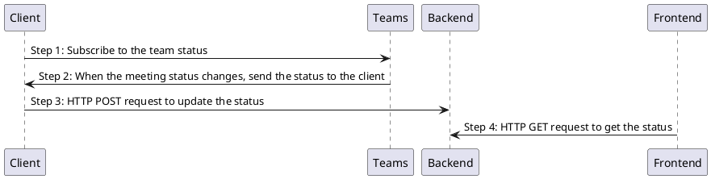
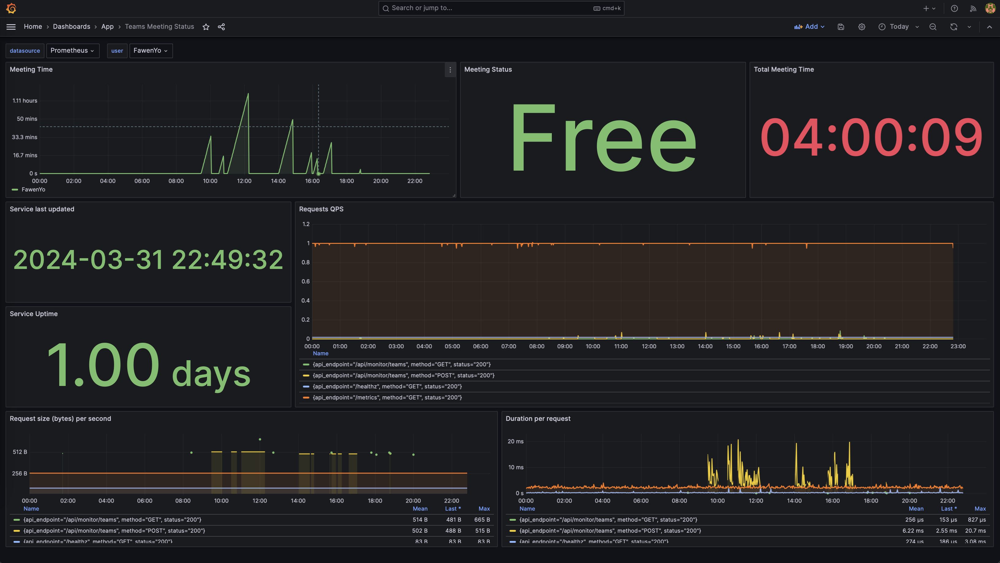
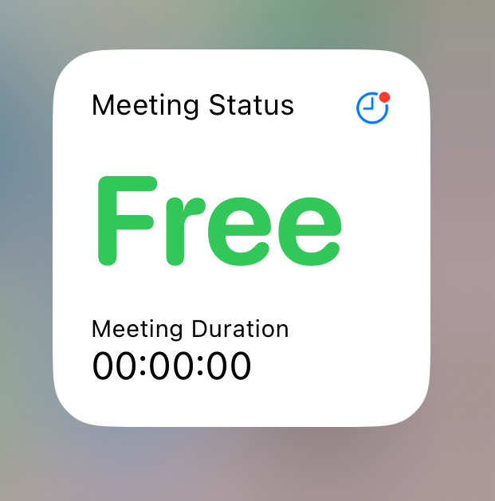
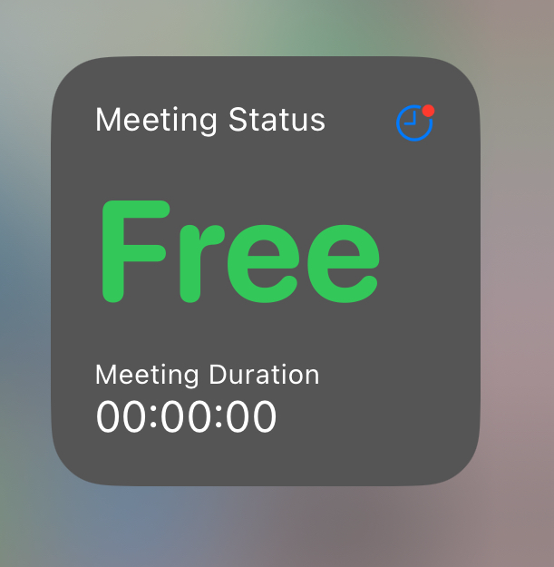
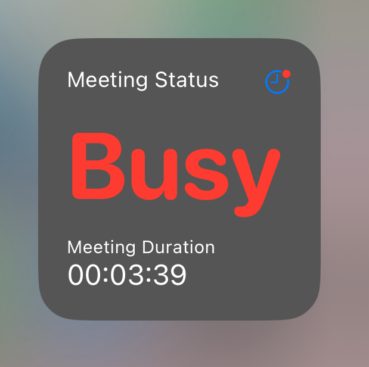

# Teams Status Monitor

This is a simple PoC to monitor the status of a team in Microsoft Teams. It uses the Microsoft WebSocket API (Reference: https://lostdomain.notion.site/Microsoft-Teams-WebSocket-API-5c042838bc3e4731bdfe679e864ab52a) to subscribe to the status of a team and then sends a HTTP request to our backend server to update the status of the team.

## Data Flow



Steps | Description
--- | ---
Step 1 | The client subscribes to the team status with the WebSocket API
Step 2 | When the meeting status changes, the WebSocket API sends the status to the client
Step 3 | The client sends a HTTP POST request to the backend server to update the status
Step 4 | When the user accesses the frontend URL, the frontend sends a HTTP GET request to the backend server to get the status

## Getting Started

### Prerequisites

- Make sure you can enable the Third-party app API in your Microsoft Teams so that you can scrape the meeting status with the WebSocket API. You can enable this by going to the `Settings` -> `Privacy` -> `Third-party app API` and enable the API.

### Installation

#### Step 1: Build the client application

You can build the client application by running the following command:

```bash
cd client
cargo build --release
```

This will create a binary in the `target/release` directory.

#### (Optional) Step 2: Deploy your backend and frontend server to the Kubernetes cluster

You have to create your own `overrides.yaml` file with the following content:

```yaml
common:
  fqdn: {YOUR_FQDN}

redis:
  url: {YOUR_REDIS_URL}
  password: {YOUR_REDIS_PASSWORD}
```

Make sure you replace the placeholders with the actual values. Then you can deploy the backend and frontend server by running the following command:

```bash
cd charts/teams-status-monitor
helm install teams-status-monitor -f overrides.yaml .
```

This will deploy the backend and frontend server to the Kubernetes cluster. Notice that you might need to edit the `ingress.yaml` file to your ingress controller as this file is written for the `traefik` ingress controller.

#### Step 3: Run the client application

There are some arguments that you can pass to the client application, you can see the help message by running the following command:

```bash
teams_meeting_monitor --help
```

Here is an example of how you can run the client application:

```bash
teams_meeting_monitor -u test_user -i https://test_image.com/test.png -s https://{YOUR_FQDN}/api/monitor/teams
```

This will start the client application and monitor the status of the team. If the status of the team changes, it will send a HTTP request to the backend server to update the meeting status.

#### (Optional) Step 4: Access the frontend server

You can go to the URL http://{YOUR_FQDN}/status?user={USER_NAME} to see the status of the team.


#### (Optional) Step 5: Import the Grafana dashboard

You can go to your Grafana dashboard and import the `grafana/dashbaords/teams-status-monitor.json` file to import the dashboard.




#### (Optional) Step 6: Setup the Scriptable widget on iOS

You can use the `Scriptable` (App Store: https://apps.apple.com/tw/app/scriptable/id1405459188?l=en-GB) app to create a widget on your iOS device. You can import the `./teams-status.js` code to the `Scriptable` app and create a widget on your home screen.

Widget Preview on light theme:



Widget Preview on dark theme:



Widget Preview on light theme with meeting started:



## References

- https://lostdomain.notion.site/Microsoft-Teams-WebSocket-API-5c042838bc3e4731bdfe679e864ab52a
